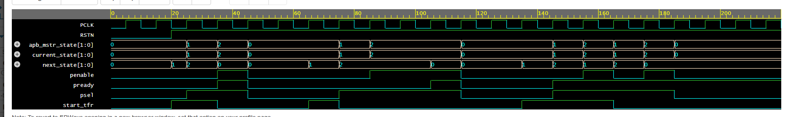
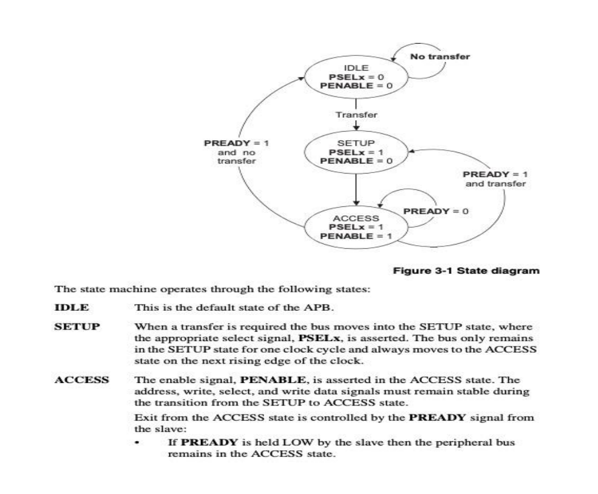

# APB Master FSM — SystemVerilog

A 3-state APB Master FSM implemented in SystemVerilog, designed and verified. 

---

## Overview

This project implements the **APB (Advanced Peripheral Bus) Master** state machine as defined by the AMBA APB protocol. The FSM controls the `PSEL` and `PENABLE` handshake signals and handles single transfers, back-to-back transfers, and wait states (when `PREADY` is de-asserted by the slave).

---

## Port Description

| Signal          | Direction | Width | Description                        |
|-----------------|-----------|-------|------------------------------------|
| `PCLK`          | Input     | 1     | Clock (active on posedge)          |
| `RSTN`          | Input     | 1     | Active-low synchronous reset       |
| `start_tfr`     | Input     | 1     | Initiates a transfer when high     |
| `pready`        | Input     | 1     | APB ready signal from slave        |
| `psel`          | Output    | 1     | APB select signal                  |
| `penable`       | Output    | 1     | APB enable signal                  |
| `apb_mstr_state`| Output    | [1:0] | Encoded current FSM state          |

---

## State Machine

| State    | `psel` | `penable` | Description                                      |
|----------|--------|-----------|--------------------------------------------------|
| `IDLE`   | 0      | 0         | Default state. Waits for `start_tfr`             |
| `SETUP`  | 1      | 0         | Transfer requested. Bus held for one clock cycle |
| `ACCESS` | 1      | 1         | Transfer in progress. Waits for `pready`         |

**Transitions:**
- `IDLE → SETUP` : when `start_tfr` asserts
- `SETUP → ACCESS` : unconditional after one clock cycle
- `ACCESS → SETUP` : when `pready=1` and `start_tfr=1` (back-to-back)
- `ACCESS → IDLE` : when `pready=1` and `start_tfr=0`
- `ACCESS → ACCESS` : when `pready=0` (wait state insertion)

---

## Testbench

The testbench covers three scenarios using SystemVerilog tasks:

| Task                   | Description                                                      |
|------------------------|------------------------------------------------------------------|
| `single_transfer`      | One transfer: IDLE → SETUP → ACCESS → IDLE                       |
| `wait_state_transfer`  | Slave holds `pready=0` for 3 cycles before asserting            |
| `back_to_back_transfer`| Continuous transfers without returning to IDLE (`start_tfr=1`)  |

Waveform dump: `apb.vcd` (generated on simulation)

---

## Waveform

## State Diagram

## Key Concepts Demonstrated

**Two-always FSM architecture** — The design uses a strict separation between the sequential state register (`always_ff`) and the combinational next-state and output logic (`always_comb`). This is the synthesis-safe 2-always style: the flip-flop block only holds state, while all decode logic is purely combinational. This avoids latches, prevents race conditions between state and output, and maps cleanly to standard cell libraries during synthesis.

**`typedef enum` for state encoding** — FSM states are declared using `typedef enum logic [1:0]` giving explicit 2-bit binary encoding (`IDLE=2'b00`, `SETUP=2'b01`, `ACCESS=2'b10`). This approach improves readability, enables simulator-level state name display in waveforms, and allows the synthesis tool to apply state encoding optimisation (binary, one-hot, gray) if needed. Using `logic` as the base type ensures 4-state semantics are preserved for simulation.

**APB handshake protocol timing** — The `PSEL`/`PENABLE` two-phase handshake is implemented exactly per the AMBA APB specification. `PSEL` asserts one cycle before `PENABLE`, creating the mandatory SETUP phase. `PENABLE` then asserts in the ACCESS phase and the transfer completes only when the slave responds with `PREADY=1`. This design correctly handles variable-length wait states by holding ACCESS until `PREADY` is sampled high on a rising clock edge.

**Mealy vs Moore output behaviour** — Outputs `psel`, `penable`, and `apb_mstr_state` are Moore-type: they depend only on the current state, not on inputs. This eliminates glitches on outputs caused by input transitions mid-cycle and ensures outputs are stable for the full clock period, which is critical for downstream slave modules sampling on the same clock edge.

**Task-based stimulus generation** — The testbench uses named SystemVerilog tasks (`single_transfer`, `wait_state_transfer`, `back_to_back_transfer`) to encapsulate repeatable stimulus sequences. This mirrors industry verification methodology where stimulus is modularised and reusable across test cases, making it straightforward to extend the testbench without duplicating timing logic.

**VCD waveform dumping** — `$dumpfile` and `$dumpvars(0, tb_apb)` generate a Value Change Dump capturing all signal transitions in the testbench hierarchy. The scope argument `0` ensures all signals at all hierarchy levels are captured, enabling full post-simulation debug in waveform viewers like GTKWave without needing a paid simulator GUI.

---

## Author

**Prisha Bhatia** — ECE, JIIT Noida   
GitHub: [prishabhatia21](https://github.com/prishabhatia21)
